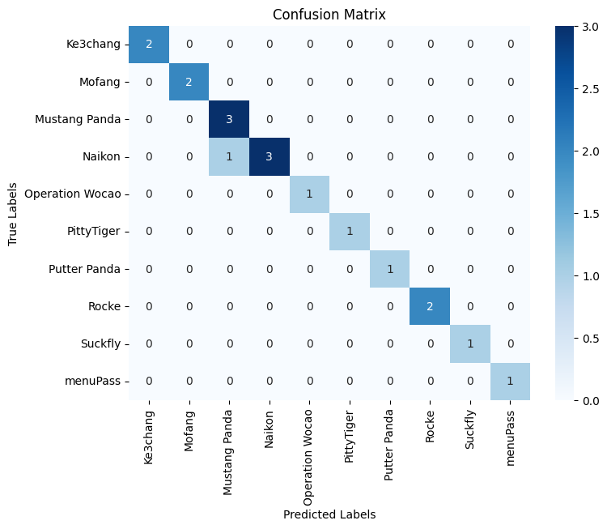
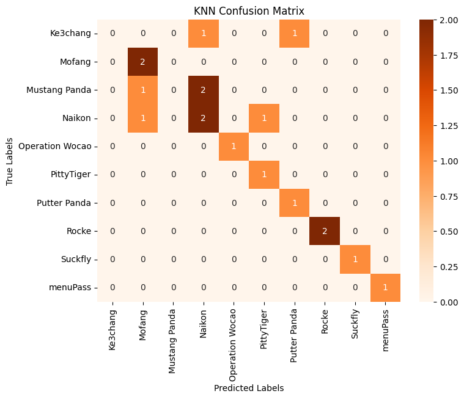
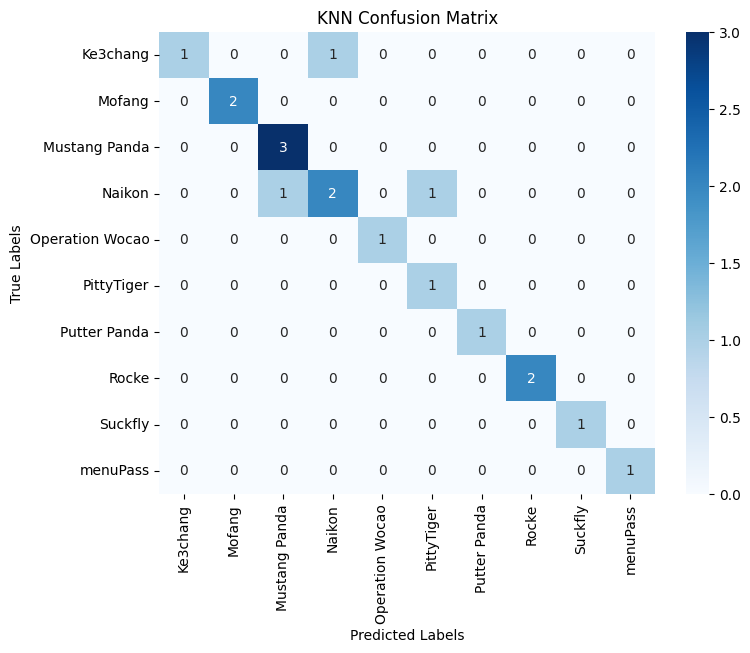
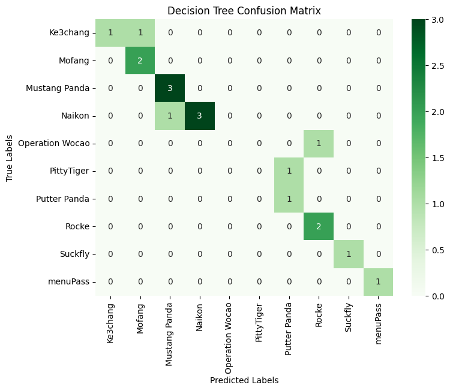
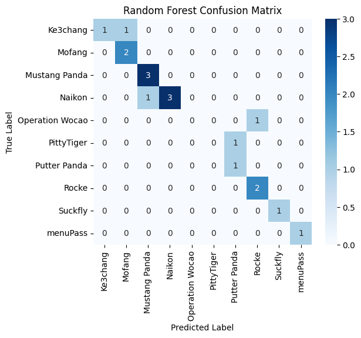
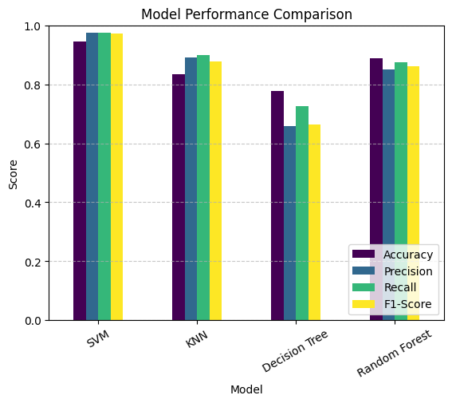

# Malware Analysis Using Machine Learning  

This project focuses on **Advanced Persistent Threat (APT) malware analysis**, OpCode extraction, and machine learning-based classification.  

## Steps  
1. Collecting malware payloads  
2. Extracting Operational Codes (OpCodes)  
3. Applying machine learning models for detection  
4. Evaluating classifier performance  

## Key Details  
- **Dataset:** `Malware_Opcodes/apt_malware_opcode_dataset.csv`  
- **Methods Used:** SVM, KNN, Decision Tree  


### Step 1 : Preparing the Raw Data Set


```python
import pandas as pd
import os
import warnings
warnings.filterwarnings("ignore")

df = pd.read_csv("metadata.csv")
base_dir = "/home/kali/mcti/jupyter_env/"

def read_opcodes(file_path):
    full_path = os.path.join(base_dir, file_path)
    try:
        with open(full_path, "r") as f:
            lines = f.readlines()
            if len(lines) < 2:
                return ""  
            return " ".join(line.strip().split(",")[1] for line in lines[1:] if "," in line)  # Extract opcode column
    except FileNotFoundError:
        print(f"Warning: File not found - {full_path}")
        return ""  # Return empty string if file is missing

df["OpCodes"] = df["Opcode File Path"].apply(read_opcodes)
df = df[["OpCodes", "APT"]]
df.to_csv("apt_opcode_dataset.csv", index=False)

print("APT Opcode dataset saved as 'apt_opcode_dataset.csv'")
```

    APT Opcode dataset saved as 'apt_opcode_dataset.csv'


### Step 2 : Pre-processing


```python
import pandas as pd

df = pd.read_csv("apt_opcode_dataset.csv")
print(f"Total Samples: {df.shape}")
df["Opcode_Count"] = df["OpCodes"].apply(lambda x: len(x.split()))
df_filtered = df[df["Opcode_Count"] >= 10]
df_filtered.to_csv("filtered_apt_opcode_dataset.csv", index=False)
apt_counts = df_filtered["APT"].value_counts()
print("\nFiltered dataset saved!")
print(f"\nRemoved {len(df) - len(df_filtered)} rows with low opcode counts.")
print("\nData Count for Each APT Group:\n")
print(apt_counts)

```

    Total Samples: (93, 2)
    
    Filtered dataset saved!
    
    Removed 7 rows with low opcode counts.
    
    Data Count for Each APT Group:
    
    APT
    Naikon             18
    Mustang Panda      15
    Rocke              10
    Ke3chang            9
    Mofang              8
    Putter Panda        7
    menuPass            5
    Operation Wocao     5
    Suckfly             5
    PittyTiger          4
    Name: count, dtype: int64


### Step3: Feature Extraction


```python
import pandas as pd
from collections import Counter

df = pd.read_csv("filtered_apt_opcode_dataset.csv")

def generate_2grams(sequence):
    return [" ".join(sequence[i:i+2]) for i in range(len(sequence)-1)]

# Extract unique 1-grams
unique_1grams = set()
unique_2grams = set()

for opcodes in df["OpCodes"]:
    opcode_list = opcodes.split()  # Tokenize opcodes
    unique_1grams.update(opcode_list)  # Collect unique 1-grams
    unique_2grams.update(generate_2grams(opcode_list))  # Collect unique 2-grams

unique_1grams = sorted(unique_1grams)
unique_2grams = sorted(unique_2grams)

one_gram_df = pd.DataFrame(0, index=df.index, columns=unique_1grams)
two_gram_df = pd.DataFrame(0, index=df.index, columns=unique_2grams)

# Count occurrences for each sample
for i, row in df.iterrows():
    opcode_list = row["OpCodes"].split()
    
    # Count 1-grams
    one_gram_counts = Counter(opcode_list)
    for opcode, count in one_gram_counts.items():
        one_gram_df.at[i, opcode] = count

    # Count 2-grams
    two_grams = generate_2grams(opcode_list)
    two_gram_counts = Counter(two_grams)
    for two_gram, count in two_gram_counts.items():
        two_gram_df.at[i, two_gram] = count


one_gram_df.to_csv("1gram_features.csv", index=False)
two_gram_df.to_csv("2gram_features.csv", index=False)

print("\n1-Gram and 2-Gram Features Extracted & Saved!")
print(f"Unique 1-Grams: {len(unique_1grams)}")
print(f"Unique 2-Grams: {len(unique_2grams)}")
```

    
    1-Gram and 2-Gram Features Extracted & Saved!
    Unique 1-Grams: 398
    Unique 2-Grams: 6712


```python
import pandas as pd

# Load the extracted 1-gram and 2-gram features
one_gram_counts_df = pd.read_csv("1gram_features.csv")
two_gram_counts_df = pd.read_csv("2gram_features.csv")

df = pd.read_csv("filtered_apt_opcode_dataset.csv")
x_combined = pd.concat([one_gram_counts_df, two_gram_counts_df], axis=1)

X = x_combined
y = df["APT"]

X.to_csv("X_combined_features.csv", index=False)
y.to_csv("y_labels.csv", index=False)

print("\nFeature Extraction Complete")
print(f"Total Features: {X.shape[1]}")
print(f"Total Samples: {X.shape[0]}")
print(f"Unique APT Groups: {y.nunique()}")
```

    
    Feature Extraction Complete
    Total Features: 7110
    Total Samples: 86
    Unique APT Groups: 10


```python
from sklearn.preprocessing import MinMaxScaler

# Initialize MinMaxScaler
scaler = MinMaxScaler()

# Normalize feature set
X_scaled = scaler.fit_transform(X)

X_scaled_df = pd.DataFrame(X_scaled, columns=X.columns)

X_scaled_df.to_csv("X_scaled_features.csv", index=False)
print("Features normalized and saved as 'X_scaled_features.csv'")

```

    Features normalized and saved as 'X_scaled_features.csv'


```python
from sklearn.model_selection import train_test_split

# 80% Training + 20% Testing (Stratified Split)
X_train, X_test, y_train, y_test = train_test_split(
    X_scaled_df, y, test_size=0.2, stratify=y, random_state=42
)

# Save train & test sets
X_train.to_csv("X_train.csv", index=False)
X_test.to_csv("X_test.csv", index=False)
y_train.to_csv("y_train.csv", index=False)
y_test.to_csv("y_test.csv", index=False)

print("Train-Test Split Complete!")
print(f"Training Samples: {X_train.shape[0]}")
print(f"Testing Samples: {X_test.shape[0]}")
```

    Train-Test Split Complete!
    Training Samples: 68
    Testing Samples: 18


### Step 4: Apply SMOTE to balance classes


```python
from imblearn.over_sampling import SMOTE

# Apply SMOTE to balance classes
smote = SMOTE(random_state=42, k_neighbors=1)
X_train_resampled, y_train_resampled = smote.fit_resample(X_train, y_train)

# Save resampled data
X_train_resampled.to_csv("X_train_resampled.csv", index=False)
y_train_resampled.to_csv("y_train_resampled.csv", index=False)

print("SMOTE Applied: Training data balanced.")

```

    SMOTE Applied: Training data balanced.


### Step 6: Reducing Dimension using PCA


```python
from sklearn.decomposition import PCA

pca = PCA(n_components=100)  
X_train_pca = pca.fit_transform(X_train_resampled)
X_test_pca = pca.transform(X_test)

# Convert to DataFrame
X_train_pca_df = pd.DataFrame(X_train_pca)
X_test_pca_df = pd.DataFrame(X_test_pca)

# Save the new PCA-reduced data
X_train_pca_df.to_csv("X_train_pca.csv", index=False)
X_test_pca_df.to_csv("X_test_pca.csv", index=False)

print(f"PCA Applied: Reduced feature dimensions from {X_train_resampled.shape[1]} to {X_train_pca.shape[1]}.")
```

    PCA Applied: Reduced feature dimensions from 7110 to 100.


```python
import numpy as np

explained_variance = np.cumsum(pca.explained_variance_ratio_)
print("\nExplained Variance per Component:\n", explained_variance)
print(f"\nTotal Variance Retained: {explained_variance[-1] * 100:.2f}%")
```

    
    Explained Variance per Component:
     [0.41610586 0.56770919 0.65912961 0.70392716 0.74591933 0.78313942
     0.81767137 0.84706231 0.86514342 0.87886325 0.89187525 0.90399454
     0.91490707 0.92565502 0.9344325  0.94132944 0.9472456  0.95261813
     0.95780383 0.96254437 0.96656001 0.97025283 0.97331308 0.97633004
     0.97915563 0.98186569 0.98433281 0.9865889  0.98860843 0.99028554
     0.99186114 0.99339574 0.99452609 0.99557975 0.99632947 0.99707107
     0.99764939 0.9981924  0.99868684 0.99914035 0.99943462 0.99969773
     0.99982422 0.99990042 0.99995895 0.99998919 0.99999983 0.99999996
     1.         1.         1.         1.         1.         1.
     1.         1.         1.         1.         1.         1.
     1.         1.         1.         1.         1.         1.
     1.         1.         1.         1.         1.         1.
     1.         1.         1.         1.         1.         1.
     1.         1.         1.         1.         1.         1.
     1.         1.         1.         1.         1.         1.
     1.         1.         1.         1.         1.         1.
     1.         1.         1.         1.        ]
    
    Total Variance Retained: 100.00%


```python
import pandas as pd

X_train_pca = pd.read_csv("X_train_pca.csv")
y_train_resampled = pd.read_csv("y_train_resampled.csv")
print(f"X_train_pca shape: {X_train_pca.shape}")  
print(f"y_train_resampled shape: {y_train_resampled.shape}")  
```

    X_train_pca shape: (140, 100)
    y_train_resampled shape: (140, 1)


```python
from sklearn.svm import SVC
from sklearn.metrics import accuracy_score, classification_report

y_train_resampled = y_train_resampled.values.ravel()

svm_model = SVC(kernel="linear", random_state=42)
svm_model.fit(X_train_pca, y_train_resampled)
y_pred = svm_model.predict(X_test_pca)

accuracy = accuracy_score(y_test, y_pred)
print(f"\nSVM Accuracy: {accuracy * 100:.2f}%")
print("\nClassification Report:")
print(classification_report(y_test, y_pred))
```

    
    SVM Accuracy: 94.44%
    
    Classification Report:
                     precision    recall  f1-score   support
    
           Ke3chang       1.00      1.00      1.00         2
             Mofang       1.00      1.00      1.00         2
      Mustang Panda       0.75      1.00      0.86         3
             Naikon       1.00      0.75      0.86         4
    Operation Wocao       1.00      1.00      1.00         1
         PittyTiger       1.00      1.00      1.00         1
       Putter Panda       1.00      1.00      1.00         1
              Rocke       1.00      1.00      1.00         2
            Suckfly       1.00      1.00      1.00         1
           menuPass       1.00      1.00      1.00         1
    
           accuracy                           0.94        18
          macro avg       0.97      0.97      0.97        18
       weighted avg       0.96      0.94      0.94        18
    


```python
from sklearn.metrics import accuracy_score, recall_score, f1_score, precision_score, confusion_matrix, classification_report
import matplotlib.pyplot as plt
import seaborn as sns  

accuracy = accuracy_score(y_test, y_pred)

# Compute precision, recall, and F1-score (macro & weighted averages)
precision = precision_score(y_test, y_pred, average='macro', zero_division=0)
recall = recall_score(y_test, y_pred, average='macro', zero_division=0)
f1 = f1_score(y_test, y_pred, average='macro')

# Compute confusion matrix
cm = confusion_matrix(y_test, y_pred)

# Print classification report
print("Classification Report:")
print(classification_report(y_test, y_pred))

svm_y_pred_best = y_pred

# Print individual scores
print(f"Accuracy: {accuracy:.2f}")
print(f"Precision: {precision:.2f}")
print(f"Recall: {recall:.2f}")
print(f"F1-score: {f1:.2f}")

# Plot confusion matrix
plt.figure(figsize=(8, 6))
sns.heatmap(cm, annot=True, fmt='d', cmap='Blues', xticklabels=np.unique(y_test), yticklabels=np.unique(y_test))
plt.xlabel('Predicted Labels')
plt.ylabel('True Labels')
plt.title('Confusion Matrix')
plt.show()
```

    Classification Report:
                     precision    recall  f1-score   support
    
           Ke3chang       1.00      1.00      1.00         2
             Mofang       1.00      1.00      1.00         2
      Mustang Panda       0.75      1.00      0.86         3
             Naikon       1.00      0.75      0.86         4
    Operation Wocao       1.00      1.00      1.00         1
         PittyTiger       1.00      1.00      1.00         1
       Putter Panda       1.00      1.00      1.00         1
              Rocke       1.00      1.00      1.00         2
            Suckfly       1.00      1.00      1.00         1
           menuPass       1.00      1.00      1.00         1
    
           accuracy                           0.94        18
          macro avg       0.97      0.97      0.97        18
       weighted avg       0.96      0.94      0.94        18
    
    Accuracy: 0.94
    Precision: 0.97
    Recall: 0.97
    F1-score: 0.97


    

    


```python
from sklearn.neighbors import KNeighborsClassifier

# Initialize KNN (rounding k=3.5 to k=3)
knn_model = KNeighborsClassifier(n_neighbors=3)

# Train KNN
knn_model.fit(X_train_pca, y_train_resampled)

# Predict on test data
y_pred_knn = knn_model.predict(X_test_pca)

# Evaluate KNN
print("\nKNN Model Performance:")
print(classification_report(y_test, y_pred_knn))

# Compute and print metrics
accuracy_knn = accuracy_score(y_test, y_pred_knn)
precision_knn = precision_score(y_test, y_pred_knn, average='macro', zero_division=0)
recall_knn = recall_score(y_test, y_pred_knn, average='macro', zero_division=0)
f1_knn = f1_score(y_test, y_pred_knn, average='macro')

print(f"KNN Accuracy: {accuracy_knn:.2f}")
print(f"KNN Precision: {precision_knn:.2f}")
print(f"KNN Recall: {recall_knn:.2f}")
print(f"KNN F1-score: {f1_knn:.2f}")

# Confusion Matrix
cm_knn = confusion_matrix(y_test, y_pred_knn)
plt.figure(figsize=(8, 6))
sns.heatmap(cm_knn, annot=True, fmt='d', cmap='Oranges', xticklabels=np.unique(y_test), yticklabels=np.unique(y_test))
plt.xlabel('Predicted Labels')
plt.ylabel('True Labels')
plt.title('KNN Confusion Matrix')
plt.show()
```

    
    KNN Model Performance:
                     precision    recall  f1-score   support
    
           Ke3chang       0.00      0.00      0.00         2
             Mofang       0.50      1.00      0.67         2
      Mustang Panda       0.00      0.00      0.00         3
             Naikon       0.40      0.50      0.44         4
    Operation Wocao       1.00      1.00      1.00         1
         PittyTiger       0.50      1.00      0.67         1
       Putter Panda       0.50      1.00      0.67         1
              Rocke       1.00      1.00      1.00         2
            Suckfly       1.00      1.00      1.00         1
           menuPass       1.00      1.00      1.00         1
    
           accuracy                           0.61        18
          macro avg       0.59      0.75      0.64        18
       weighted avg       0.48      0.61      0.52        18
    
    KNN Accuracy: 0.61
    KNN Precision: 0.59
    KNN Recall: 0.75
    KNN F1-score: 0.64


    

    


```python
from sklearn.model_selection import GridSearchCV
from sklearn.neighbors import KNeighborsClassifier

# Define KNN model
knn = KNeighborsClassifier()

# Define hyperparameter grid
knn_params = {
    'n_neighbors': [3, 5, 7, 9],  # Trying different values for k
    'weights': ['uniform', 'distance'],  
    'metric': ['euclidean', 'manhattan']
}

# Initialize GridSearchCV
knn_grid = GridSearchCV(knn, knn_params, cv=5, scoring='accuracy', n_jobs=-1)

# Fit on training data
knn_grid.fit(X_train_pca, y_train_resampled)

# Get best parameters and best model
best_knn = knn_grid.best_estimator_
best_knn_params = knn_grid.best_params_


```


```python
from sklearn.metrics import classification_report, confusion_matrix
import seaborn as sns
import matplotlib.pyplot as plt
import numpy as np


y_pred_knn_best = best_knn.predict(X_test_pca)

print("\nOptimized KNN Performance on Test Data:")
print(classification_report(y_test, y_pred_knn_best, zero_division=0))
cm_knn = confusion_matrix(y_test, y_pred_knn_best)
plt.figure(figsize=(8, 6))
sns.heatmap(cm_knn, annot=True, fmt='d', cmap='Blues', xticklabels=np.unique(y_test), yticklabels=np.unique(y_test))
plt.xlabel('Predicted Labels')
plt.ylabel('True Labels')
plt.title('KNN Confusion Matrix')
plt.show()

```

    
    Optimized KNN Performance on Test Data:
                     precision    recall  f1-score   support
    
           Ke3chang       1.00      0.50      0.67         2
             Mofang       1.00      1.00      1.00         2
      Mustang Panda       0.75      1.00      0.86         3
             Naikon       0.67      0.50      0.57         4
    Operation Wocao       1.00      1.00      1.00         1
         PittyTiger       0.50      1.00      0.67         1
       Putter Panda       1.00      1.00      1.00         1
              Rocke       1.00      1.00      1.00         2
            Suckfly       1.00      1.00      1.00         1
           menuPass       1.00      1.00      1.00         1
    
           accuracy                           0.83        18
          macro avg       0.89      0.90      0.88        18
       weighted avg       0.86      0.83      0.83        18
    


    

    


```python
from sklearn.tree import DecisionTreeClassifier
from sklearn.ensemble import RandomForestClassifier
from sklearn.model_selection import RandomizedSearchCV
from sklearn.metrics import classification_report


X_train_dt, X_test_dt, y_train_dt, y_test_dt = X_train, X_test, y_train, y_test

param_dist_dt = {
    "max_depth": [5, 10, 20, None],  # Tree depth
    "min_samples_split": [2, 5, 10],  # Minimum samples to split a node
    "min_samples_leaf": [1, 2, 5, 10],  # Minimum samples in a leaf node
    "criterion": ["gini", "entropy"],  # Splitting criterion
}


dt_model = DecisionTreeClassifier(random_state=42)


random_search_dt = RandomizedSearchCV(
    dt_model, param_dist_dt, n_iter=20, cv=5, scoring="accuracy", n_jobs=-1, random_state=42
)
random_search_dt.fit(X_train_dt, y_train_dt)

print("\nBest Hyperparameters for Decision Tree:", random_search_dt.best_params_)

best_dt = random_search_dt.best_estimator_
y_pred_dt_best = best_dt.predict(X_test_dt)


print("\nDecision Tree Model Performance:")
print(classification_report(y_test_dt, y_pred_dt_best))

cm_dt = confusion_matrix(y_test, y_pred_dt_best)
plt.figure(figsize=(8, 6))
sns.heatmap(cm_dt, annot=True, fmt='d', cmap='Greens', xticklabels=np.unique(y_test), yticklabels=np.unique(y_test))
plt.xlabel('Predicted Labels')
plt.ylabel('True Labels')
plt.title('Decision Tree Confusion Matrix')
plt.show()

```

    
    Best Hyperparameters for Decision Tree: {'min_samples_split': 2, 'min_samples_leaf': 1, 'max_depth': 10, 'criterion': 'gini'}
    
    Decision Tree Model Performance:
                     precision    recall  f1-score   support
    
           Ke3chang       1.00      0.50      0.67         2
             Mofang       0.67      1.00      0.80         2
      Mustang Panda       0.75      1.00      0.86         3
             Naikon       1.00      0.75      0.86         4
    Operation Wocao       0.00      0.00      0.00         1
         PittyTiger       0.00      0.00      0.00         1
       Putter Panda       0.50      1.00      0.67         1
              Rocke       0.67      1.00      0.80         2
            Suckfly       1.00      1.00      1.00         1
           menuPass       1.00      1.00      1.00         1
    
           accuracy                           0.78        18
          macro avg       0.66      0.72      0.66        18
       weighted avg       0.75      0.78      0.73        18
    


    

    


```python
from sklearn.ensemble import RandomForestClassifier
from sklearn.model_selection import RandomizedSearchCV

# Define hyperparameter grid
param_dist = {
    "n_estimators": [50, 100, 200, 500],
    "max_depth": [5, 10, 20, None],
    "min_samples_split": [2, 5, 10],
    "min_samples_leaf": [1, 2, 5, 10],
    "max_features": ["sqrt", "log2", None],
    "bootstrap": [True, False]
}

# Initialize Random Forest model
rf_model = RandomForestClassifier(random_state=42)

# Randomized Search
random_search = RandomizedSearchCV(
    rf_model, param_dist, n_iter=20, cv=5, scoring="accuracy", n_jobs=-1, random_state=42
)
random_search.fit(X_train, y_train)  # Train with the best hyperparameters

# Get best parameters
print("Best Hyperparameters:", random_search.best_params_)

# Train Random Forest with best parameters
best_rf = random_search.best_estimator_
y_pred_rf_best = best_rf.predict(X_test)

# Evaluate
from sklearn.metrics import classification_report
print("\nRandom Forest Model Performance:")
print(classification_report(y_test, y_pred_rf_best))

cm = confusion_matrix(y_test, y_pred_rf_best)

# Plot confusion matrix
plt.figure(figsize=(6, 5))
plt.title("Random Forest Confusion Matrix")
sns.heatmap(cm_dt, annot=True, fmt='d', cmap='Blues', xticklabels=np.unique(y_test), yticklabels=np.unique(y_test))
plt.xlabel("Predicted Label")
plt.ylabel("True Label")
plt.show()

```

    Best Hyperparameters: {'n_estimators': 50, 'min_samples_split': 2, 'min_samples_leaf': 2, 'max_features': 'log2', 'max_depth': 20, 'bootstrap': False}
    
    Random Forest Model Performance:
                     precision    recall  f1-score   support
    
           Ke3chang       1.00      1.00      1.00         2
             Mofang       1.00      1.00      1.00         2
      Mustang Panda       0.75      1.00      0.86         3
             Naikon       0.75      0.75      0.75         4
    Operation Wocao       1.00      1.00      1.00         1
         PittyTiger       0.00      0.00      0.00         1
       Putter Panda       1.00      1.00      1.00         1
              Rocke       1.00      1.00      1.00         2
            Suckfly       1.00      1.00      1.00         1
           menuPass       1.00      1.00      1.00         1
    
           accuracy                           0.89        18
          macro avg       0.85      0.88      0.86        18
       weighted avg       0.85      0.89      0.87        18
    


    

    


```python
import pandas as pd
import matplotlib.pyplot as plt
import seaborn as sns
from sklearn.metrics import accuracy_score, precision_score, recall_score, f1_score, classification_report

# 🚀 Compute Performance Metrics for Each Model
models = ["SVM", "KNN", "Decision Tree", "Random Forest"]
y_preds = [svm_y_pred_best, y_pred_knn_best, y_pred_dt_best, y_pred_rf_best]

# Store results in lists
accuracies = [accuracy_score(y_test, y_pred) for y_pred in y_preds]
precisions = [precision_score(y_test, y_pred, average='macro', zero_division=0) for y_pred in y_preds]
recalls = [recall_score(y_test, y_pred, average='macro', zero_division=0) for y_pred in y_preds]
f1_scores = [f1_score(y_test, y_pred, average='macro', zero_division=0) for y_pred in y_preds]

# 🚀 Create DataFrame for comparison
performance_df = pd.DataFrame({
    "Model": models,
    "Accuracy": accuracies,
    "Precision": precisions,
    "Recall": recalls,
    "F1-Score": f1_scores
})

# 🚀 Print the Performance Table
print("\n🔹 Model Performance Comparison:")
print(performance_df)

# 🚀 Plot Performance Comparison as Bar Chart
plt.figure(figsize=(10, 6))
performance_df.plot(x="Model", kind="bar", colormap="viridis", rot=30)
plt.title("Model Performance Comparison")
plt.ylabel("Score")
plt.ylim(0, 1)  # Scores range from 0 to 1
plt.legend(loc="lower right")
plt.grid(axis="y", linestyle="--", alpha=0.7)
plt.show()

```

    
    🔹 Model Performance Comparison:
               Model  Accuracy  Precision  Recall  F1-Score
    0            SVM  0.944444   0.975000   0.975  0.971429
    1            KNN  0.833333   0.891667   0.900  0.876190
    2  Decision Tree  0.777778   0.658333   0.725  0.664762
    3  Random Forest  0.888889   0.850000   0.875  0.860714


    <Figure size 1000x600 with 0 Axes>


    

    


```python

```
