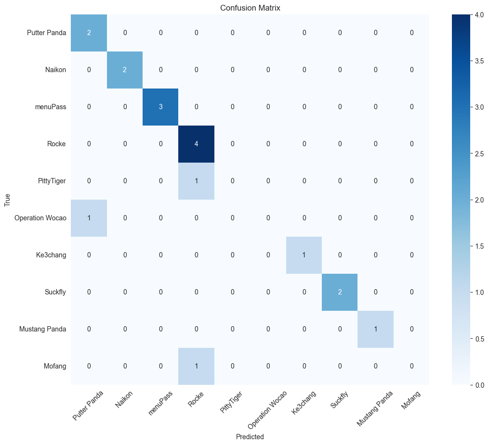
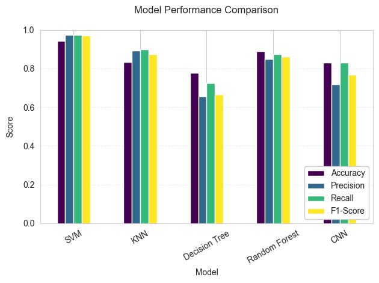

# Malware Analysis Using Machine Learning  

This project focuses on **Advanced Persistent Threat (APT) malware analysis**, OpCode extraction, and machine learning-based classification. In this section,  Reproducing the methodology from "Deep Android Malware Detection" (reference paper) and benchmarking against traditional approaches.  

## Key Details  
- **Dataset:** `Malware_Opcodes/apt_malware_opcode_dataset.csv`  
- **Methods Used:** CNN  


## Step 1: Setting Up the Environment (with GPU Acceleration)

To efficiently train the deep learning model, the environment has been configured to utilize GPU acceleration. GPUs are capable of performing parallel computations, which significantly speeds up training times for deep neural networks.

### Required Libraries

The following libraries are required:
- **PyTorch:** For building and training the neural network.
- **Pandas:** For data manipulation and analysis.
- **Scikit-learn:** For splitting the dataset and evaluating model performance.
- **Matplotlib & Seaborn:** For data visualization.
- **NumPy:** For numerical operations.

These packages can be installed with the following command:


```python
pip install torch torchvision torchaudio pandas scikit-learn matplotlib seaborn numpy
```

    Requirement already satisfied: torch in c:\users\nisal\cnn_venv\lib\site-packages (2.6.0+cu126)
    Requirement already satisfied: torchvision in c:\users\nisal\cnn_venv\lib\site-packages (0.21.0+cu126)
    Requirement already satisfied: torchaudio in c:\users\nisal\cnn_venv\lib\site-packages (2.6.0+cu126)
    Requirement already satisfied: pandas in c:\users\nisal\cnn_venv\lib\site-packages (2.2.3)
    Requirement already satisfied: scikit-learn in c:\users\nisal\cnn_venv\lib\site-packages (1.6.1)
    Requirement already satisfied: matplotlib in c:\users\nisal\cnn_venv\lib\site-packages (3.10.1)
    Requirement already satisfied: seaborn in c:\users\nisal\cnn_venv\lib\site-packages (0.13.2)
    Requirement already satisfied: numpy in c:\users\nisal\cnn_venv\lib\site-packages (2.1.2)
    Requirement already satisfied: filelock in c:\users\nisal\cnn_venv\lib\site-packages (from torch) (3.13.1)
    Requirement already satisfied: typing-extensions>=4.10.0 in c:\users\nisal\cnn_venv\lib\site-packages (from torch) (4.12.2)
    Requirement already satisfied: networkx in c:\users\nisal\cnn_venv\lib\site-packages (from torch) (3.3)
    Requirement already satisfied: jinja2 in c:\users\nisal\cnn_venv\lib\site-packages (from torch) (3.1.4)
    Requirement already satisfied: fsspec in c:\users\nisal\cnn_venv\lib\site-packages (from torch) (2024.6.1)
    Requirement already satisfied: setuptools in c:\users\nisal\cnn_venv\lib\site-packages (from torch) (70.2.0)
    Requirement already satisfied: sympy==1.13.1 in c:\users\nisal\cnn_venv\lib\site-packages (from torch) (1.13.1)
    Requirement already satisfied: mpmath<1.4,>=1.1.0 in c:\users\nisal\cnn_venv\lib\site-packages (from sympy==1.13.1->torch) (1.3.0)
    Requirement already satisfied: pillow!=8.3.*,>=5.3.0 in c:\users\nisal\cnn_venv\lib\site-packages (from torchvision) (11.0.0)
    Requirement already satisfied: python-dateutil>=2.8.2 in c:\users\nisal\cnn_venv\lib\site-packages (from pandas) (2.9.0.post0)
    Requirement already satisfied: pytz>=2020.1 in c:\users\nisal\cnn_venv\lib\site-packages (from pandas) (2025.2)
    Requirement already satisfied: tzdata>=2022.7 in c:\users\nisal\cnn_venv\lib\site-packages (from pandas) (2025.2)
    Requirement already satisfied: scipy>=1.6.0 in c:\users\nisal\cnn_venv\lib\site-packages (from scikit-learn) (1.15.2)
    Requirement already satisfied: joblib>=1.2.0 in c:\users\nisal\cnn_venv\lib\site-packages (from scikit-learn) (1.4.2)
    Requirement already satisfied: threadpoolctl>=3.1.0 in c:\users\nisal\cnn_venv\lib\site-packages (from scikit-learn) (3.6.0)
    Requirement already satisfied: contourpy>=1.0.1 in c:\users\nisal\cnn_venv\lib\site-packages (from matplotlib) (1.3.1)
    Requirement already satisfied: cycler>=0.10 in c:\users\nisal\cnn_venv\lib\site-packages (from matplotlib) (0.12.1)
    Requirement already satisfied: fonttools>=4.22.0 in c:\users\nisal\cnn_venv\lib\site-packages (from matplotlib) (4.56.0)
    Requirement already satisfied: kiwisolver>=1.3.1 in c:\users\nisal\cnn_venv\lib\site-packages (from matplotlib) (1.4.8)
    Requirement already satisfied: packaging>=20.0 in c:\users\nisal\cnn_venv\lib\site-packages (from matplotlib) (24.2)
    Requirement already satisfied: pyparsing>=2.3.1 in c:\users\nisal\cnn_venv\lib\site-packages (from matplotlib) (3.2.3)
    Requirement already satisfied: six>=1.5 in c:\users\nisal\cnn_venv\lib\site-packages (from python-dateutil>=2.8.2->pandas) (1.17.0)
    Requirement already satisfied: MarkupSafe>=2.0 in c:\users\nisal\cnn_venv\lib\site-packages (from jinja2->torch) (2.1.5)
    Note: you may need to restart the kernel to use updated packages.


```python
import torch
import torch.nn as nn
import torch.optim as optim
from torch.utils.data import Dataset, DataLoader, Subset
import pandas as pd
import numpy as np
from sklearn.preprocessing import LabelEncoder
from sklearn.model_selection import train_test_split
import matplotlib.pyplot as plt
import seaborn as sns
from sklearn.metrics import classification_report, confusion_matrix

# Set device
device = torch.device('cuda' if torch.cuda.is_available() else 'cpu')
print(f"Using device: {device}")
```

    Using device: cuda


## Step 2: Initial data Preparation and filtering

In this section, the raw metadata is loaded and the opcode sequences are extracted from each file. A CSV file (`apt_opcode_dataset.csv`) is created by reading file paths from the metadata and extracting the opcode column. Files that are missing or contain insufficient data are handled appropriately.

After creating the initial dataset, samples with fewer than 10 opcodes are filtered out to ensure only meaningful data is retained. The filtered dataset is saved as `filtered_apt_opcode_dataset.csv` and the distribution of APT labels is examined to provide an overview of the data before further processing.


```python
import pandas as pd
import os
import warnings
warnings.filterwarnings("ignore")

df = pd.read_csv("metadata.csv")
base_dir = "C:/Users/nisal/cnn_venv/cnn/"

def read_opcodes(file_path):
    full_path = os.path.join(base_dir, file_path)
    try:
        with open(full_path, "r") as f:
            lines = f.readlines()
            if len(lines) < 2:
                return ""  
            return " ".join(line.strip().split(",")[1] for line in lines[1:] if "," in line)  # Extract opcode column
    except FileNotFoundError:
        print(f"Warning: File not found - {full_path}")
        return ""  # Return empty string if file is missing

df["OpCodes"] = df["Opcode File Path"].apply(read_opcodes)
df = df[["OpCodes", "APT"]]
df.to_csv("apt_opcode_dataset.csv", index=False)

print("APT Opcode dataset saved as 'apt_opcode_dataset.csv'")
```

    APT Opcode dataset saved as 'apt_opcode_dataset.csv'


```python
# Load raw opcode dataset
df = pd.read_csv("apt_opcode_dataset.csv")
print(f"Initial samples: {len(df)}")

# Filter samples with <10 opcodes
df["Opcode_Count"] = df["OpCodes"].apply(lambda x: len(x.split()))
df_filtered = df[df["Opcode_Count"] >= 10].copy()
print(f"Removed {len(df) - len(df_filtered)} samples with low opcode counts")

# Save filtered data
df_filtered.to_csv("filtered_apt_opcode_dataset.csv", index=False)
print("\nClass distribution after filtering:")
print(df_filtered["APT"].value_counts())
```

    Initial samples: 93
    Removed 7 samples with low opcode counts
    
    Class distribution after filtering:
    APT
    Naikon             18
    Mustang Panda      15
    Rocke              10
    Ke3chang            9
    Mofang              8
    Putter Panda        7
    menuPass            5
    Operation Wocao     5
    Suckfly             5
    PittyTiger          4
    Name: count, dtype: int64


### Step3: Dataset Creation


```python
class OpcodeDataset(Dataset):
    def __init__(self, sequences, labels, max_len=15000):
        self.tokenizer = LabelEncoder()
        all_opcodes = [opcode for seq in sequences for opcode in seq.split()]
        self.tokenizer.fit(all_opcodes)
        
        self.sequences = sequences
        self.labels = LabelEncoder().fit_transform(labels)
        self.num_classes = len(np.unique(self.labels))
        self.max_len = max_len
    
    def __len__(self):
        return len(self.sequences)
    
    def __getitem__(self, idx):
        seq = self.sequences[idx].split()
        encoded = self.tokenizer.transform(seq)
        padded = np.zeros(self.max_len, dtype=np.int64)
        length = min(len(encoded), self.max_len)
        padded[:length] = encoded[:length]
        return torch.tensor(padded, dtype=torch.long), torch.tensor(self.labels[idx], dtype=torch.long)
```


```python
dataset = OpcodeDataset(df_filtered["OpCodes"].values, df_filtered["APT"].values)

# Stratified split using indices
train_idx, val_idx = train_test_split(
    range(len(dataset)), 
    test_size=0.2, 
    stratify=dataset.labels,
    random_state=42
)

# Create subsets
train_dataset = Subset(dataset, train_idx)  # Now works with imported Subset
val_dataset = Subset(dataset, val_idx)

train_loader = DataLoader(train_dataset, batch_size=8, shuffle=True)
val_loader = DataLoader(val_dataset, batch_size=8)

print(f"\nTrain samples: {len(train_dataset)}")
print(f"Validation samples: {len(val_dataset)}")
```

    
    Train samples: 68
    Validation samples: 18


## Step 4: CNN Model Creation

A deep convolutional neural network (CNN) has been defined to classify malware based on raw opcode sequences by reffering the model described in paper 'Deep Android Malware Detection'.


```python
class MalwareCNN(nn.Module):
    def __init__(self, vocab_size, embed_dim=8, num_classes=11):
        super().__init__()
        self.embedding = nn.Embedding(vocab_size, embed_dim)
        self.conv1 = nn.Conv1d(embed_dim, 64, kernel_size=8)
        self.pool = nn.AdaptiveMaxPool1d(1)
        self.fc1 = nn.Linear(64, 16)
        self.fc2 = nn.Linear(16, num_classes)
        self.dropout = nn.Dropout(0.5)
    
    def forward(self, x):
        x = self.embedding(x).permute(0, 2, 1)  # [batch, embed_dim, seq_len]
        x = torch.relu(self.conv1(x))
        x = self.pool(x).squeeze(-1)
        x = torch.relu(self.fc1(self.dropout(x)))
        return self.fc2(x)

model = MalwareCNN(vocab_size=len(dataset.tokenizer.classes_)).to(device)
print(model)
```

    MalwareCNN(
      (embedding): Embedding(398, 8)
      (conv1): Conv1d(8, 64, kernel_size=(8,), stride=(1,))
      (pool): AdaptiveMaxPool1d(output_size=1)
      (fc1): Linear(in_features=64, out_features=16, bias=True)
      (fc2): Linear(in_features=16, out_features=11, bias=True)
      (dropout): Dropout(p=0.5, inplace=False)
    )


## Step 5: Training the Model


```python
criterion = nn.CrossEntropyLoss()
optimizer = torch.optim.RMSprop(model.parameters(), lr=0.001)

# Early stopping parameters
patience = 10  # Number of epochs to wait before stopping
best_val_accuracy = 0
no_improvement = 0

# Track metrics
history = {'train_loss': [], 'val_accuracy': []}

for epoch in range(100):  # Now set to maximum epochs
    # Training phase
    model.train()
    train_loss = 0
    for inputs, labels in train_loader:
        inputs, labels = inputs.to(device), labels.to(device)
        optimizer.zero_grad()
        outputs = model(inputs)
        loss = criterion(outputs, labels)
        loss.backward()
        optimizer.step()
        train_loss += loss.item()
    history['train_loss'].append(train_loss / len(train_loader))
    
    # Validation phase
    model.eval()
    correct = 0
    total = 0
    with torch.no_grad():
        for inputs, labels in val_loader:
            inputs, labels = inputs.to(device), labels.to(device)
            outputs = model(inputs)
            _, preds = torch.max(outputs, 1)
            total += labels.size(0)
            correct += (preds == labels).sum().item()
    val_accuracy = correct / total
    history['val_accuracy'].append(val_accuracy)
    
    print(f"Epoch {epoch+1}: Train Loss = {history['train_loss'][-1]:.4f}, Val Acc = {val_accuracy:.4f}")
    
    # Early stopping logic
    if val_accuracy > best_val_accuracy:
        best_val_accuracy = val_accuracy
        no_improvement = 0
        torch.save(model.state_dict(), 'best_model.pth')
        print(f"New best model saved (Acc: {best_val_accuracy:.4f})")
    else:
        no_improvement += 1
        if no_improvement >= patience:
            print(f"\nEarly stopping at epoch {epoch+1} (No improvement for {patience} epochs)")
            break

# Load best model
model.load_state_dict(torch.load('best_model.pth'))
print(f"\nTraining complete. Best validation accuracy: {best_val_accuracy:.4f}")
```

    Epoch 1: Train Loss = 2.1033, Val Acc = 0.4444
    New best model saved (Acc: 0.4444)
    Epoch 2: Train Loss = 2.0073, Val Acc = 0.5556
    New best model saved (Acc: 0.5556)
    Epoch 3: Train Loss = 1.9604, Val Acc = 0.5556
    Epoch 4: Train Loss = 1.9442, Val Acc = 0.5556
    Epoch 5: Train Loss = 1.7895, Val Acc = 0.6111
    New best model saved (Acc: 0.6111)
    Epoch 6: Train Loss = 1.7339, Val Acc = 0.4444
    Epoch 7: Train Loss = 1.7434, Val Acc = 0.5556
    Epoch 8: Train Loss = 1.7358, Val Acc = 0.5556
    Epoch 9: Train Loss = 1.7973, Val Acc = 0.5000
    Epoch 10: Train Loss = 1.7387, Val Acc = 0.7222
    New best model saved (Acc: 0.7222)
    Epoch 11: Train Loss = 1.6641, Val Acc = 0.6667
    Epoch 12: Train Loss = 1.6675, Val Acc = 0.6667
    Epoch 13: Train Loss = 1.6184, Val Acc = 0.7222
    Epoch 14: Train Loss = 1.7190, Val Acc = 0.6667
    Epoch 15: Train Loss = 1.5248, Val Acc = 0.7778
    New best model saved (Acc: 0.7778)
    Epoch 16: Train Loss = 1.5920, Val Acc = 0.7778
    Epoch 17: Train Loss = 1.5212, Val Acc = 0.7222
    Epoch 18: Train Loss = 1.4636, Val Acc = 0.8333
    New best model saved (Acc: 0.8333)
    Epoch 19: Train Loss = 1.6859, Val Acc = 0.7778
    Epoch 20: Train Loss = 1.4652, Val Acc = 0.7222
    Epoch 21: Train Loss = 1.5180, Val Acc = 0.7778
    Epoch 22: Train Loss = 1.4937, Val Acc = 0.7222
    Epoch 23: Train Loss = 1.4904, Val Acc = 0.7778
    Epoch 24: Train Loss = 1.3950, Val Acc = 0.7778
    Epoch 25: Train Loss = 1.4588, Val Acc = 0.7222
    Epoch 26: Train Loss = 1.2932, Val Acc = 0.7778
    Epoch 27: Train Loss = 1.4178, Val Acc = 0.6667
    Epoch 28: Train Loss = 1.5252, Val Acc = 0.7778
    
    Early stopping at epoch 28 (No improvement for 10 epochs)
    
    Training complete. Best validation accuracy: 0.8333


## Step 6: Evaluating the Performance


```python
def plot_confusion_matrix(true_labels, pred_labels, class_names):
    cm = confusion_matrix(true_labels, pred_labels)
    plt.figure(figsize=(12, 10))
    sns.heatmap(cm, annot=True, fmt='d', 
                xticklabels=class_names, 
                yticklabels=class_names,
                cmap='Blues')
    plt.title('Confusion Matrix')
    plt.xlabel('Predicted')
    plt.ylabel('True')
    plt.xticks(rotation=45)
    plt.show()

def evaluate_model(model, loader, class_names):
    model.eval()
    all_preds = []
    all_labels = []
    
    with torch.no_grad():
        for inputs, labels in loader:
            inputs = inputs.to(device)
            outputs = model(inputs)
            _, preds = torch.max(outputs, 1)
            all_preds.extend(preds.cpu().numpy())
            all_labels.extend(labels.cpu().numpy())
    
    print("Classification Report:")
    print(classification_report(all_labels, all_preds, target_names=class_names))
    plot_confusion_matrix(all_labels, all_preds, class_names)
    
    accuracy = np.mean(np.array(all_preds) == np.array(all_labels))
    print(f"Accuracy: {accuracy:.4f}")
    return accuracy

# Run evaluation
class_names = df_filtered["APT"].unique()
val_accuracy = evaluate_model(model, val_loader, class_names)
```

    Classification Report:
                     precision    recall  f1-score   support
    
       Putter Panda       0.67      1.00      0.80         2
             Naikon       1.00      1.00      1.00         2
           menuPass       1.00      1.00      1.00         3
              Rocke       0.67      1.00      0.80         4
         PittyTiger       0.00      0.00      0.00         1
    Operation Wocao       0.00      0.00      0.00         1
           Ke3chang       1.00      1.00      1.00         1
            Suckfly       1.00      1.00      1.00         2
      Mustang Panda       1.00      1.00      1.00         1
             Mofang       0.00      0.00      0.00         1
    
           accuracy                           0.83        18
          macro avg       0.63      0.70      0.66        18
       weighted avg       0.72      0.83      0.77        18
    


    

    


    Accuracy: 0.8333


## Step 7: Comparison with Previous models


```python
import pandas as pd
import matplotlib.pyplot as plt

# 1. Create the DataFrame with your exact metrics
performance_df = pd.DataFrame({
    "Model": ["SVM", "KNN", "Decision Tree", "Random Forest", "CNN"],
    "Accuracy": [0.944, 0.833, 0.778, 0.889, 0.83],
    "Precision": [0.975, 0.892, 0.658, 0.850, 0.72],
    "Recall": [0.975, 0.900, 0.725, 0.875, 0.83],
    "F1-Score": [0.971, 0.876, 0.665, 0.861, 0.77]
})

# 2. Generate the plot (your preferred style)
plt.figure(figsize=(20, 12))
performance_df.plot(
    x="Model",
    kind="bar",
    colormap="viridis",
    rot=30
)

# 3. Formatting (minimal cleanups)
plt.title("Model Performance Comparison", pad=20)
plt.ylabel("Score", labelpad=10)
plt.ylim(0, 1)  # Slightly above 1 for value labels
plt.legend(loc="lower right", framealpha=1)
plt.grid(axis="y", linestyle="--", alpha=0.3)
plt.tight_layout()
plt.show()
```


    <Figure size 2000x1200 with 0 Axes>


    

    


```python

```
